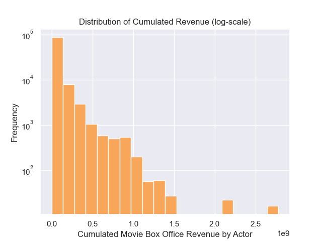
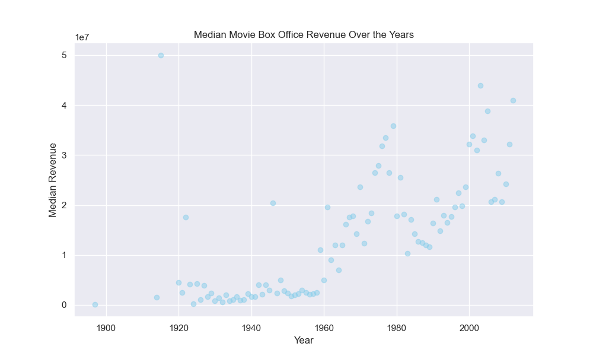
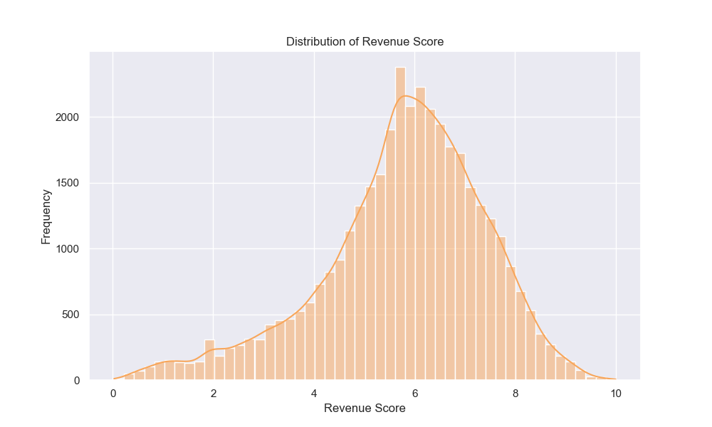
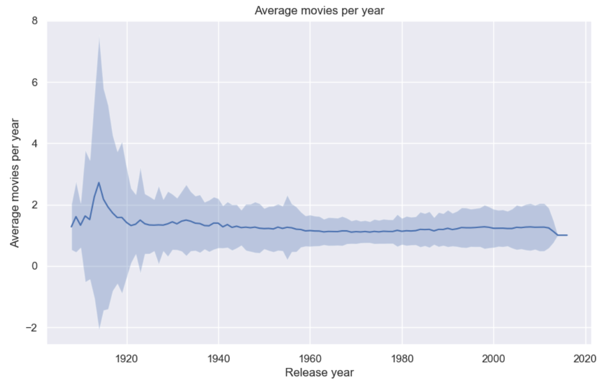
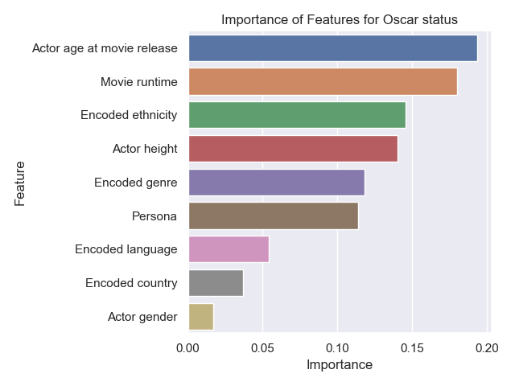
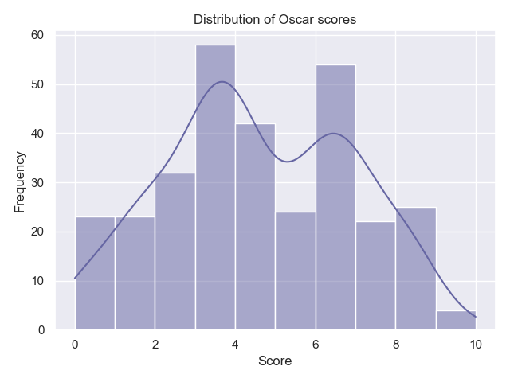
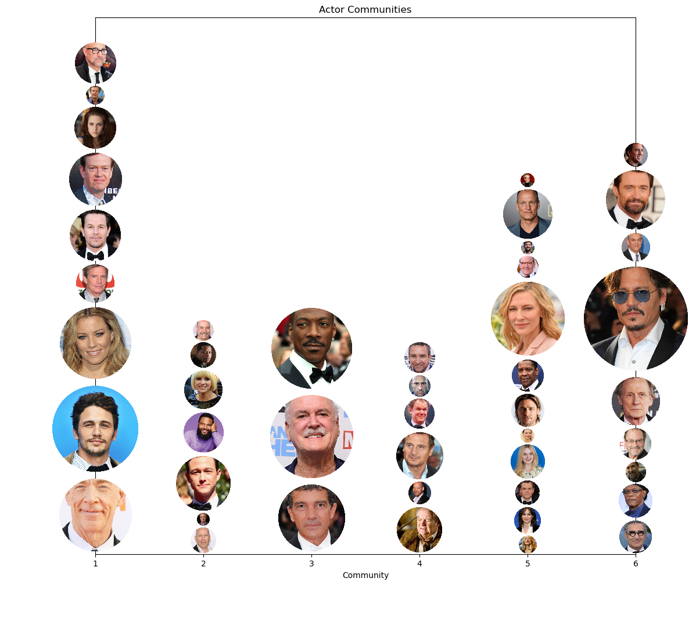

In the movie industry, the journey to stardom is as varied as the stories on screen. Many dream of becoming actors, but what characterizes their success is still a mystery. This data story explores the details of an actor's success using the CMU Movie Summary Corpus dataset. We want to quantify success along several metrics such as awards, money, ratings, popularity, or longevity for actors. Our aim is to measure and understand the various aspects of personal success in the film industry.

Quantifying an actor’s success is a challenge considering the various ways it can be measured. Peer recognition, box office earnings, positive reviews, and long careers are just a few of the dimensions that contribute to an actor's accomplishment. As we navigate through the CMU dataset, we acknowledge the inherent subjectivity in evaluating success and the diverse goals that actors may pursue.

To shed light on the diverse factors influencing an actor's journey, we articulate several research questions:
* What are the different ways to be successful and are they correlated?
* What drives these different dimensions of success?
* How much do personal characteristics matter (age, gender, etc)?
* How much do movie characteristics matter (genre, country, etc)?
* Do actors achieve success by making thoughtful decisions regarding their careers, such as diversifying the countries or languages to work in, or by strategically choosing the genres or personas they portray in movies?

Join us on this exciting journey through data as we unravel the secrets behind an actor's ascent to stardom, offering a unique perspective on the intricate tapestry of success in the world of cinema!

-----------------

## Part 1 ??

#### Exemple insertion plot (ne pas effacer) 

<iframe src="assets/plot/inflation-plot.html" width="750px" height="530px" frameborder="0" position="relative">Genre plot</iframe>

-----------------------

## What metrics whould we define ? 

When considering the success of an actor, it is clear that 

### Revenue score
When considering the success of an actor, it is clear that revenues matters. A high salary earned from participating in a movie is not just a financial achievement, it serves as a validation of an actor's performance. It is a proof of the industry's recognition, affirming the quality of their work and its appreciation for it.

Nevertheless, information regarding the personal income earned by actors for their roles in movies is not easily available. Hence, we consider movie box office revenues. In the film industry, box office revenues directly reflect the popularity and commercial success of a movie. Actors who consistently contribute to high-grossing films are often perceived as valuable assets in the industry, and in turn, successful.

Cumulated revenues from movies then act as a proxy for the cumulated revenues of actors but are an imperfect substitute.
Someone can play an unimportant role in many high revenues movies but it doesn't mean that they are getting a lot of income from it. Moreover, the causal relation between the presence of an actor in a movie and the money the movie generated is unclear. Some actors may specifically seek to play in movies that they know are going to be big (because of the people involved, the budget, …) while other have a direct influence on the movie’s profitability by participating. We do not establish any claim on this but simply acknowledge that an actor being associated with many profitable movies is an indicator of success.

Cumulative earnings in the film industry exhibit a power law distribution, with a small fraction of actors participating in films that generate massive profits.

We associate this amount to characteristics that are fixed over an actor's career: their gender and the number of movies, languages, countries, or movie genre they played in. The persona variable, added in a previous part of this project, adds information on the number of role types the actor played. It is a good proxy for how diversified one’s acting performances is. 
Performing a regression, we find that all variables are statistically significant at the 5% level, meaning that the above-mentioned variables contribute to explain a part of the variations in cumulated revenues.

Diversification appears to yield positive outcomes, as engaging in diverse languages, genres, and personas correlates with increased revenues. Gender also has a significant impact on revenues, with male actors experiencing a 0.91 higher revenues relative to the median compared to actresses.
Quite conter-intuitively, playing in one more movie in a career is associated with lower revenues. This might be explained by the fact that big actors play only in selected movies whether those with smaller roles have to play in many small movies to sustain themselves. The many movies they play in is still not enough to gain as much money as big movie stars.
Additionally, revenues experience a decline when actors engage in projects across more countries, as the coefficient on the number of unique countries one’s movies where from is negative. It suggests potential benefits from concentrating efforts within a single movie industry.

To compare revenues, we do not consider different living standards across countries though we use revenues in USD consistently. However, we want to normalize the revenues per year to account for economic boosts and booms that might explain some yearly variations in revenues. We thus compare the revenues of a movie with respect to the revenues of the median profitable movie that year.
As expected, the median revenues of movies have increased over time, highlighting the relevance of normalizing our data.

We obtain a score between 0 and 10 directly linked to cumulated movie revenues.

### Longevity score

#### Frequency of appearance

The first analysis we will focus on is the frequency of appearances in movies per year. In fact, one can interpret a presence in serveral movies in a short period of time as a success factor. The main focus here is to consider frequencies at different periods, different gender and different regions in the world.

In order to avoid to give too much importance to actors who appeared a lot during one year, we could focus on the mean frequency, which discriminates actors that once played in a lot of movies and then appeared way less, and this is a way to measure an entire career factor.  We filtered all the years before 1908 which seems not very insightful, and then plot the average frequency per year with the standard deviation for both genders and different regions of the world.

<button class="button" style="margin: 8px 0; width: 20%; margin-left: 130px; margin-right: 5px" onclick="swapImage3('assets/img/flavor_graph_different_edges.png')">All connections</button>
<button class="button" style="width: 20%; margin-right: 5px;" onclick="swapImage3('assets/img/avgmoviebygen.png')">By Gender</button>
<button class="button" style="width: 20%;" onclick="swapImage3('assets/img/avgmoviebyreg.png')">By Region</button>

It's evident that during the 1910s, the United States produced a majority of male actors, particularly known for their frequent appearances in numerous movies within a single year. However, when considering mean frequency, women from the same period also displayed high participation at that time. The context of the 1910s is crucial because during this period produced more short-movie, that demanded less effort compared to now-a-days movies. Additionally, the limited pool of available actors resulted in recurring roles for figures like Roscoe Arbuckle, Charlie Chaplin, Oliver Hardy for males, and Charlotte Burton and Louise Lester for females.

We can see that even if the mean frequency remains constant over time (with a peak in the 1910s in the US as seen before) and that there are not a lot of differences between men and women, considering the datas over time highlights different trends over time, like  the emergence of Asian movie since the 1970 which corresponds to [Bollywood golden era](https://www.nfi.edu/what-is-bollywood/#:~:text=Bollywood%2C%20often%20known%20as%20the,around%201000%20films%20every%20year.).

This highlights the significance of considering the production period of movies in our assessment, showcasing the distinctive conditions and factors influencing actors' involvement and industry dynamics during that time.

#### Career span

While some actors gain fame by appearing in numerous movies within a short timeframe, others achieve recognition due to their everlasting careers. Our focus now is to examine the career spans of each actor, taking into account their first and last appearances in the provided dataset.

Our analysis will delve into regional and gender differences, with a look at mid-career age (where available) to assess whether commencing a career at a young age holds significance in an actor's trajectory.

//Plots span

The analysis reveals that actors in South America and Europe tend to have a higher mid-career age compared to those in other regions, while those in Asia and Oceania exhibit a lower mid-career age. Although the dataset for Africa is limited, it suggests a trend toward shorter career spans, whereas the distribution in other regions appears more varied and diverse

#### Number of movies

Finally, despite the insights we got from the combined analyses of frequency and career span, it's crucial to consider the total number of movies an actor has made throughout their career. This step is essential due to potential missing values in the initial dataset and the impact that career breaks might have on reducing the mean frequency.

This forthcoming analysis will specifically concentrate on the density of movies produced, by gender and region. By examining movie density across these parameters, we aim to gain a more comprehensive understanding on the measuring of success.

//Plots nbmv

There are noticeable disparities between males and females in terms of the number of movies made (we applied a threshold to the male dataset for a clearer plot), with males generally being more numerous and having a higher overall number of movies. However, despite these differences, both genders exhibit a similar distribution pattern in terms of movie density. It is also crucial to highlight that the 'V' gaps in the plot result from missing values at specific movie counts — there are no actors with that exact number of movies.

Finally, the longevity score consists of a balanced combination between these 3 components. 

### Ratings

### Awards
Awards are also a good metric for success, as they account for audience or peer recognition. Notably, the Oscars stand out as a famous and prestigious ceremony where awards are given according to industry specialists.

It is essential to recognize that the Oscars take place in the US. Consequently, non-American actors, even from prolific film industries like Bollywood or Nollywood, predominantly find recognition in the best international film category. While an in-depth analysis could encompass additional award ceremonies such as the BAFTA Film Awards, Césars Film Awards, Golden Globes, Filmfare, and others, these ceremonies too exhibit national biases. Our dataset leans towards favoring US movies and, in turn, US actors, implying that the lack of Oscar nomination or award does not truly encapsulate an actor's global award-winning potential. Success in other country can be substantial and not necessarily reflected by this analysis.

Conducting a random forest classification, we predict Oscar nominations or awards for actors based on specific performances in individual films. Eligibility spans the previous calendar year, so we consider features associated with a particular movie and year, excluding irrelevant factors like post-Oscar characteristics. We isolate key variables for prediction, including the actor's age on movie release date, gender, ethnicity, height (as a proxy for physique), movie language, country, genre, runtime, and persona (type of role played in the movie).

We obtain that the most important feature is the actor's age when the movie is released, closely followed by the movie runtime. On the other side of the spectrum, gender does not seem to explain much of Oscars' winning. It was predictable since both men and women win as many Oscars and are not competing. Overall, it seems like both movie and actor characteristics are important to predict the nomination or award of Oscars. Ethnicity is an important feature as well, but the model does not allow us to say who it is favorable to.

Finally, we want to create a score between 0 and 10 based on the probability of being nominated or winning an Oscar for a given movie and actor. To do so, we compute a weighted sum of the probabilities to have nothing, get a nomination, or get an award given by our model. Then, we simply sum up the scores by actor to obtain a score representative of getting an Oscar over their entire career. 

### Trends
-----------------------
## Combining our success scores
Our goal is to offer a more nuanced understanding on the determinants of success. By combining diverse metrics, we strive for a more exhaustive examination given the limitations in each isolated measure. Using several score measures complementarily is key to go past potential biases and picture a more representative concept of success. Additionally, we want to investigate the correlation between various notions of success. For instance, do the actors successful at having a long career also have good ratings?

[pairplot]
[correlations]

The pairwise correlations between success scores is not high, ranging from 0.08 to 0.38, but are always positive. Trends and Oscars exhibit the strongest correlations, which can be explained by the spotlight getting an Oscar nomination or award give to an actor, leading to more Google searches. Rating and trends have the weakest correlation, suggesting that trending is not always positive in the sense that it is not strongly correlated with good ratings. We observe a slightly positive slope in the graph linking revenues and Oscars indicating that playing in movies generating higher revenues is correlated with higher Oscar score (which is directly linked to the probability to get an Oscar over one’s career).

The lack of strong correlations among scores implies that the pursuit of different types of accomplishments such as money, peer recognition, longevity, or positive ratings does not necessarily align. Our findings imply that success is multifaceted, and different characteristics may lead to distinct but equally valid forms of success. They also suggest that there is room for achieving success for many, as long as not everyone seeks the same dimension of it.
This raises questions about the nature of success and whether focusing on one type of success goal could be a good strategy.  

### The success story of Tom Cruise
Are you familiar with Tom Cruise? Would you consider him a successful actor? If so, based on the insights shared earlier, what specific metrics contribute to his success?

With the help of our analysis, we can now provide a quantitative assessment. Here is a spider chart representing various dimensions of Tom Cruise's success.

[spiders]

Tom Cruise demonstrates success across multiple dimensions. As we observed, diversification plays a crucial role in achieving high revenues. In the case of Oscars, factors such as the actor's age and the movie's duration come into play. This holds true for Tom Cruise, who has received three Oscar nominations and has been involved in movies that collectively generated x million USD.

-----------------------

## Star Power: The Influence of Cast on Movie Revenue
Ever wonder how much of a role the cast of a movie plays in its financial success? In this section, we'll delve into the relationship between a movie's cast and its box office revenue. We'll analyze the impact of individual actors on a film's financial performance. We'll also conduct network analysis to evaluate the roles of actor combinations in generating revenue. Whether you're a fan of A-list celebrities or indie darlings, let's find out if the cast really does make a difference in box office success.

### Who's the Biggest Box Office Draw? Analyzing the Impact of Actors on Revenue
We want to understand how much the people in a movie contribute to its financial success. To do this, we're using linear regression. It helps us see how strong the relationship is between a movie's cast and its box office revenue, and if anything else could be affecting this relationship. By fitting a line to the data, we can see how much each actor matters for a movie's financial performance.

We're only looking at actors who have been in more than 10 movies. This helps us exclude one-time wonders and makes sure our findings are more typical of the movie industry. It's possible that actors with fewer movies can affect a movie's financial success, but these cases might not be as accurate or typical. By sticking to actors who have more experience, we can feel more confident about the conclusions we draw about what leads to financial success in the movie industry.

| Actor | coefficient (in million $) | p-value |
|-------|--------------------------|---------|
| Cate Blanchett | 107.8 | 0.000 |
| Seann William Scott | 83.2 | 0.000 |
| James Franco | 74.5 | 0.003 |
| Johnny Depp | 60.7 | 0.004 |
| Anna Faris | 58.5 | 0.010 |

One interesting thing we found is that, out of the top 10 factors that seem to matter most for movie revenue (based on how strong their relationship is and how likely it is that this relationship isn't just a coincidence), the only ones besides budget are the actors. This suggests that these actors make a big impact on how much money a movie makes. But it's important to remember that an actor's impact on revenue might not just depend on their own performance. It could also depend on who they're acting with in the movie. For example, an actor might do better at the box office when they're in a movie with certain co-stars, but not as well with others. This is why we used network analysis to look at how actors work together and see if that affects revenue. For example, will Cate Blanchett rank as one of the top revenue-generating actors when we consider actor communities?

It's also worth mentioning that budget is a big factor in how much money a movie makes, but it's closely related to the revenue itself. This means it might not be as useful for understanding the impact of individual actors. We'll come back to budget later in our analysis.

### The Movie Cast Factor: How Actor combinations affect financial success
Have you ever noticed that some actors seem to be in a ton of movies together? Network analysis can help us see these connections between actors and how they might affect each other's impact on a movie's revenue. By turning the relationships between actors into a visual network, we can find patterns and communities in the movie industry and get a deeper understanding of how actors contribute to revenue. Network analysis can give us some really interesting insights and help us make sense of all the complex data we have about actors and revenue. Overall, adding this technique to our analysis of actor contributions can help us understand things in a new way.

We made a graph that shows how actors are connected through the movies they've been in together. The size of the nodes shows how much the movies that actor was in made on average, and the thickness of the lines shows how many movies the actors were in together.

Our graph has 61 actors and 256 connections. In the next section, we'll take a closer look at it and use network analysis techniques to see what we can learn. We'll use these techniques to find groups of actors who often work together and see how important each actor is in the network. By looking at these actor communities, we can get a more detailed picture of how actors collaborate and how different combinations of actors affect movie revenue.

<button class="button" style="width: 30%; margin-left: 240px;" onclick="swapImage()">Average revenue on/off</button>

We used the Louvain method to split the network of actors into six different communities based on how they're connected through movies. This shows us that there are some actors who tend to work together more often. When we looked closer, we saw that the average revenue for actors in each community varies. Some actors seem to do especially well at the box office. However, we also saw that there was no significant difference in average revenue between the communities, with one exception. This could mean that the community an actor belongs to doesn't necessarily have a big impact on how much money their movies make.

Regardless, it's still interesting to see how actors are connected and how they collaborate. By looking at these patterns and communities, we can get a better understanding of the movie industry and how different combinations of actors might affect revenue. We'll plot the initial graph again, but this time we'll highlight the connections within each community and the connections between communities. This will help us see the patterns of collaboration and how they relate to movie revenue.

<button class="button" style="margin: 8px 0; width: 20%; margin-left: 130px; margin-right: 5px" onclick="swapImage3('assets/img/flavor_graph_different_edges.png')">All connections</button>
<button class="button" style="width: 20%; margin-right: 5px;" onclick="swapImage3('assets/img/community_graph.png')">Community</button>
<button class="button" style="width: 20%;" onclick="swapImage3('assets/img/non_community_edges.png')">Non-community</button>

We want to know if there's a difference in revenue when a movie's cast is mostly made up of actors from one community versus actors from a bunch of different communities. To do this, we'll look at the patterns of collaboration within and between communities and see how they affect revenue.

To understand the relationships between actors and their impact on revenue better, we're going to split the movies into two groups: those with a cast that's mostly made up of actors from one community, and those with a cast that's more evenly spread out among different communities. This will let us compare movies with more similar casts to movies with more diverse casts, and see if there's a relationship between cast composition and revenue. By looking at these two groups of movies, we can get an idea of the pros and cons of casting actors from one community versus a mix of communities, and how it might affect a movie's success.

We noticed that there's a big difference in average revenue between movies with a cast that's mostly from one community and movies with a more evenly distributed cast. To make sure this difference isn't just because of other factors, we're using matching to compare movies with similar characteristics. By controlling for these other factors, we can be more certain that any differences in revenue we see are because of the cast composition. This will help us understand the relationship between cast composition and movie revenue better. The next plot compares movies with a cast that is largely concentrated within a single community to those with a more evenly distributed cast. We've matched these movies so that other factors that could affect revenue are controlled for. 

<iframe src="assets/plot/evenly_vs_majority.html" width="600px" height="400px" frameborder="0" style="display: block; margin: 0 auto;">Difference in community cast</iframe>

Our analysis shows that movies with a majority of actors from a specific community have a big impact on box office revenue. In both estimates, with and without matching, the treatment effect was huge - around $51620924.7 and $39424016.7, respectively. The difference between these two estimates was around -23.63%, and both estimates were statistically significant with a p-value of 0.0.

We didn't use budget as a matching variable in this analysis because it's probably closely related to the cast. If we used budget as a matching variable, it might be hard to see the independent effect of the cast on revenue. That being said, budget is still an important factor that can affect a movie's production value and overall appeal to audiences. For example, a movie with a high budget might make more money because it has more money for marketing and a wider distribution.

-----------------------

## Runtime: The Sweet Spot
Are you ready to find out if a movie's runtime can make or break its box office success? From epics to quick hits, we'll delve into the data to discover whether longer or shorter films come out on top. But before we get started, let's take a quick look at the distribution of runtime across all movies and see which range is most common.

<iframe src="assets/plot/crazy_runtime_plot.html" width="750px" height="630px" frameborder="0" position="relative">Runtime Histogram</iframe>

It looks like most movies fall within the 80-120 minute range, with a slight skew towards the longer end of the spectrum.

Now that we've looked at the distribution of runtime across all movies, let's see if longer or shorter movies come out on top in terms of box office success. At first glance, it looks like there might be a slight positive relationship between the two. But when we dig a little deeper using linear regression, we see that this relationship isn't strong enough to draw any solid conclusions. In fact, the R-squared value is pretty low, meaning that runtime isn't a strong predictor of box office success.

However, when we break things down by runtime intervals, we see that movies with runtimes between 80-120 minutes seem to generate larger revenue compared to the movies with runtime less than 80 minutes.  This raises the question: is 80 minutes some kind of threshold for box office performance? We'll explore this further in the next section.

### Does it hurt if runtime is too short?
It seems that shorter movies may have a harder time raking in the big bucks. In fact, our analysis shows that movies with a runtime under 80 minutes tend to generate significantly less revenue than their longer counterparts. But don't worry, it's not all bad news for short films. While it may be tougher for them to reach blockbuster status, there are still shorter movies that manage to perform well at the box office. So, the takeaway here is that while runtime alone may not be a make-or-break factor for a movie's success, it's definitely something to consider when trying to craft a recipe for box office gold.

<iframe src="assets/plot/short_vs_nonshort.html" width="750px" height="630px" frameborder="0" position="relative">short vs nonshort Histogram</iframe>

It's clear from our analysis that shorter movies tend to struggle at the box office compared to their longer counterparts. In fact, our independent t-test showed a statistically significant difference in revenue between short and non-short movies, with short movies earning an average of 53.9% less. So, if you're thinking about making a movie, it might be best to aim for a runtime of at least 80 minutes to give your film the best chance at box office success.

### Are blockbuster movies generally longer in runtime?
Are longer movies really the key to box office success? Let's take a closer look at the data to find out. We found that when comparing short movies to non-short movies, the latter tends to generate significantly more revenue. In fact, short movies make on average 53.9% less revenue than non-short movies. But wait, there's more! When we compared the runtime of blockbuster movies (those with a revenue of $400 million or more) to non-blockbusters, we found that blockbusters tend to have longer runtimes on average. In fact, blockbusters have a runtime that is 10.05% longer than non-blockbusters. It seems that there may be some truth to the idea that longer movies have an advantage at the box office. However, it's important to keep in mind that this is just a tiny piece of the puzzle. There are many other factors that can impact a movie's success, and it's likely that the relationship between runtime and revenue is not a simple one.

-----------------------

## The Power of Words: How Movie Plot Sentiment Affects Box Office Success
In this section, we delve into the power of words in movie plot summaries and how they can impact a film's box office success. By analyzing the proportion of positive, negative, and violent words in plot summaries, we can gain insights into how movie studios can craft engaging and successful storylines. Join us as we explore the relationship between sentiment analysis and revenue!

<!-- Create the buttons -->
<button class="button" style="margin: 8px 0; width: 20%; margin-left: 130px; margin-right: 5px" onclick="showFrame('positive')">Positive</button>
<button class="button" style="width: 20%; margin-right: 5px;" onclick="showFrame('negative')">Negative</button>
<button class="button" style="width: 20%;" onclick="showFrame('violent')">Violent</button>

<!-- Create the iframes -->
<iframe class="toggle-frame" src="assets/plot/revenue_positive_bar.html" width="750px" height="530px" frameborder="0" position="relative" id="positive" style="display: block;">positive barplot</iframe>
<iframe class="toggle-frame" src="assets/plot/revenue_negative_bar.html" width="750px" height="530px" frameborder="0" position="relative" id="negative" style="display: none;">negative barplot</iframe>
<iframe class="toggle-frame" src="assets/plot/revenue_violent_bar.html" width="750px" height="530px" frameborder="0" position="relative"  id="violent" style="display: none;">violent barplot</iframe>

From our bar plots, it appears that movies with a higher proportion of negative words in their plot summary tend to have higher revenues compared to movies with a higher proportion of positive words. One potential reason for this could be that negative themes and storylines often generate more interest and tension, which can draw in larger audiences. Similarly, movies with a higher proportion of violent words also tend to have higher revenues, possibly because violent content can also be seen as more exciting and engaging. It's important to note that while there is a correlation between these plot characteristics and box office success, this does not necessarily mean that including more negative or violent elements in a movie's plot will guarantee higher revenues. Other factors, such as the quality of the movie, the acting, and the overall production value, also play a significant role in a movie's success.

In conclusion, our analysis of plot summaries has shown that movies with more negative plot are more successful, with a 45.3% increase in revenue compared to movies with more positive plot. This finding highlights the importance of considering the sentiment of a movie's plot when striving for box office success. So next time you're planning a blockbuster hit, don't be afraid to inject a little bit of negativity into your story.

### Sentiment Showdown: Comparing the Plot Summaries of Blockbusters and Non-Blockbusters
Blockbuster movies appear to have a preference for negative and violent plot elements, as indicated by the higher proportion of negative and violent words in their summaries. This is supported by the small p-values and the significant mean differences found in our independent t-tests. In comparison, blockbusters tend to have a lower proportion of positive words in their summaries compared to non-blockbusters. These findings suggest that incorporating more negative and violent elements into a movie's plot may increase its chances of becoming a blockbuster, while a more positive plot may hinder its box office success. However, it's important to note that these results should be interpreted with caution, as other factors may contribute to a movie's box office success.

-----------------------

## The secret recipe for box office success: A data-driven guide

Congratulations, you've reached the end of our data-driven guide to creating the ultimate box office hit! Now it's time to put our findings into action and cook up a recipe for success.

But before you start gathering your ingredients, it's important to remember that just like in cooking, the success of your movie will depend not only on the individual ingredients, but also on how they all work together. Adding a superstar actor like Johnny Depp to your cast might sound like a no-brainer, but it's also important to consider how that will affect the rest of the cast and the overall direction of the film. Similarly, changing the genre of your movie might mean that you need to reevaluate the best release date to maximize your revenue.

So, without further ado, here's our recipe for the ultimate box office hit:

- Aim for an ethnicity score above 0.33 to attract a diverse audience
- Keep the fraction of females in your cast below 0.33 to appeal to a wider audience
- Consider the genre of your movie when choosing the best release month. Action, action/adventure, and adventure movies may do best in May, while crime fiction, comedy, drama, romantic comedy, and thrillers may perform best in June. Romance films may fare well in November and indie films may do well in December.
- The right combination of actors in your movie cast can make a big impact on its box office success. Keep in mind that having a majority of actors from a specific community can significantly affect your revenue.
- Don't be afraid to add a dash of negativity to your plot - it might just be the secret ingredient that sets your movie apart. And last but not least, don't forget to season your recipe with a generous helping of violence - it could give your movie the edge it needs to be a blockbuster.

With these ingredients in hand, you're well on your way to creating a box office hit that will have audiences coming back for seconds. Happy cooking!

-------------
