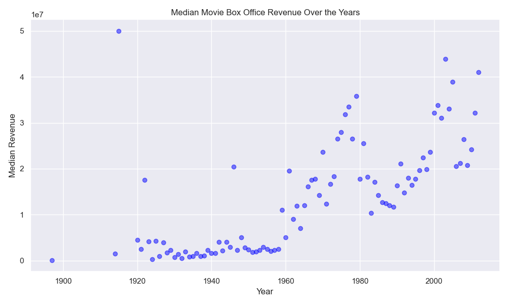
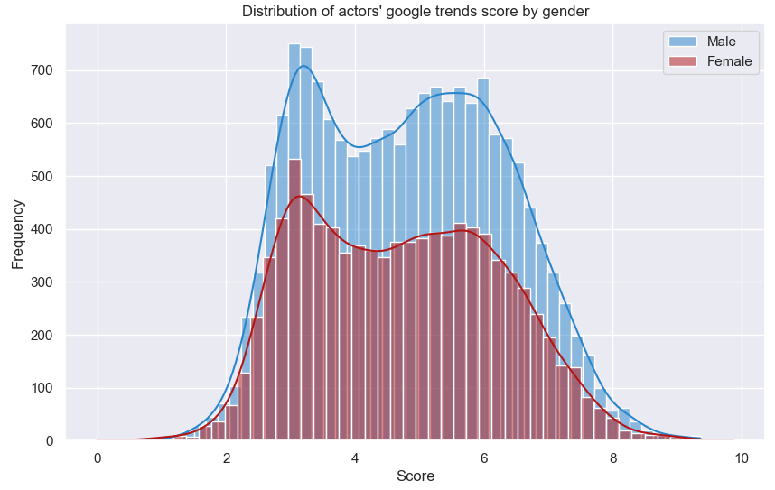
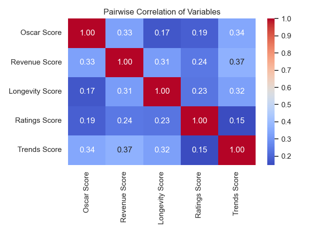
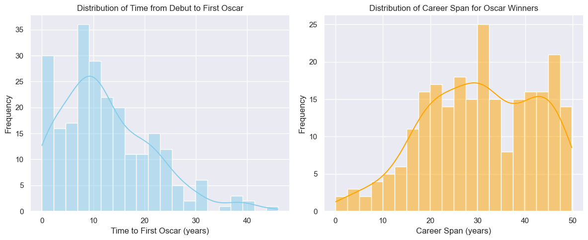

In the movie industry, the journey to stardom is as varied as the stories on screen. Many dream of becoming actors, but what characterizes their success is still a mystery. This data story explores the details of an actor's success using the CMU Movie Summary Corpus dataset. We want to quantify success along several metrics such as awards, money, ratings, popularity, or longevity for actors. Our aim is to measure and understand the various aspects of personal success in the film industry.

Quantifying an actor’s success is a challenge considering the various ways it can be measured. Peer recognition, box office earnings, positive reviews, and long careers are just a few of the dimensions that contribute to an actor's accomplishment. As we navigate through the CMU dataset, we acknowledge the inherent subjectivity in evaluating success and the diverse goals that actors may pursue.

To shed light on the various factors influencing an actor's journey, we articulate several research questions:
* What are the different ways to be successful and are they correlated?
* What drives these different dimensions of success?
* How much do personal characteristics matter (age, gender, etc)?
* How much do movie characteristics matter (genre, country, etc)?
* Do actors achieve success by making thoughtful decisions regarding their careers, such as diversifying the countries or languages to work in, or by strategically choosing the genres or personas they portray in movies?

Join us on this exciting journey through data as we unravel the secrets behind an actor's ascent to stardom, offering a unique perspective on the intricate tapestry of success in the world of cinema!

-----------------
## Defining and Analyzing Key Success Metrics
-----------------
### Personas

Character archetypes, as diverse and nuanced as the human experience itself, provide storytellers with a rich variety of personas that resonate universally. These archetypes encapsulate familiar traits, behaviors, and motivations that have stood the test of time, offering a framework for understanding the human psyche. When applied to the realm of film and performance, character archetypes become a fascinating lens through which to quantify the versatility of roles. An actor's ability to convincingly portray a range of archetypes—from the hero and the villain to the sage and the jester—reflects not only their talent but also their capacity to tap into the depth and complexity of human emotion.

The exploration of character archetypes in the context of film personas draws inspiration from the work of scientists: David Bamman, Brendan O’Connor and Noah A. Smith , on developping computational methods to uncover character types from movie summaries: [Learning Latent Personas of Film Characters](https://aclanthology.org/P13-1035.pdf). This work, defines personas as sets of mixtures over latent lexical classes. These classes capture stereotypical actions, attributes, and roles that characters embody in storytelling. The article also used the CMU Movie summary dataset for text-driven film analysis and provides a benchmark testbed, marking a significant step toward understanding the intricacies of character representation in narratives. The study's insights have served as a foundation for for identifying persona clusters linked to each character, providing a method to quantify the diversity of roles portrayed by actors. The computational analysis of character archetypes contributes to a better comprehension of the versatile and dynamic nature of storytelling in the world of cinema. The character persona clustering was performed over a preset amount 50 clusters, being a hyperparameter of the model. 
The figure below presents the distribution of the number of distinct personas embodied by actors. 

<iframe id="persona_distribution" src="assets/img/persona.html" width="750px" height="530px" frameborder="0"></iframe>

This distribution reveals a heavy-tailed pattern, hence the use of a logarithmic scale in the visualization. The trend suggests that a significant majority of actors in the dataset tend to portray a limited number of character types: the distribution is particularly concentrated towards smaller values of persona numbers.

Within the scope of this study, the number of unique personas played by an actor over the course of their career emerges as a crucial metric in gauging versatility.

### Longevity score
 While persona count sheds light on the diversity of an actor's roles, the longevity score, delves into the temporal aspect of their career. Derived from a combination of metrics, including the frequency of appearance, career span, and movie count—the, longevity score serves as a tool for gaining insights into an actor's wealth of experience. This metric helps us understand the lasting contibution of an actor in the film industry.
 
#### Frequency of appearance

Our initial analysis centers on the frequency of an actor's appearances in movies per year. A high frequency within a short timeframe can be seen as a success factor. Our primary emphasis lies in examining these frequencies across various time periods, genders, and  different regions in the world.

To mitigate the potential overemphasis on actors with increased activity during a single year, we center our attention on the mean frequency. This approach effectively distinguishes actors who displayed a peak in movie appearances, followed by reduced activity—an insightful measure of their overall career trajectory. We excluded data preceding 1908, considering it less informative, and proceeded to graph the average frequency per year alongside standard deviation for both genders and diverse global regions.

<button onclick="swapImageMalo1()">Gender/Region</button>

In the 1910s, a notable trend emerges as the United States predominantly produced male actors, recognized for their prolific appearances in numerous movies within a single year. However, when considering mean frequency, women from the same era also displayed high participation. The context of the 1910s is crucial because during this period more short-movie were produced, that demanded less effort compared to now-a-days. Additionally, the era witnessed a limited pool of available actors, leading to recurring roles for prominent figures such as Roscoe Arbuckle, Charlie Chaplin, and Oliver Hardy for men, as well as Charlotte Burton and Louise Lester for women.

We can see that even if the mean frequency remains constant over time (with a peak in the 1910s in the US as seen before) and that there are not a lot of differences between men and women, the temporal analysis highlights different trends and patterns, like  the emergence of Asian movie since the 1970 which corresponds to [Bollywood golden era](https://www.nfi.edu/what-is-bollywood/#:~:text=Bollywood%2C%20often%20known%20as%20the,around%201000%20films%20every%20year.) and also the progressive appearance of african actors since 1950. Note that the missing data in Oceania results in distinctive peaks for each year between 1935 and 1970. 

This highlights the significance of considering the production period of movies in our assessment, showcasing the distinctive conditions and factors influencing actors' involvement and industry dynamics during that time.

#### Career span

While some actors gain fame by appearing in numerous movies within a short timeframe, others achieve recognition due to their everlasting careers. Our focus now is to examine the career spans of each actor, taking into account their first and last appearances in the provided dataset.

Our analysis will delve into regional and gender differences, with a look at mid-career age (where available) to assess whether starting a career at a young age holds significance in an actor's trajectory.

  

<button onclick="swapImageMalo2()">Gender/Region</button>

The analysis reveals that actors in South America and Europe tend to have a higher mid-career age compared to those in other regions, while those in Asia and Oceania exhibit a lower mid-career age. Although the dataset for Africa is limited, it suggests a trend toward shorter career spans, whereas the distribution in other regions appears more varied and diverse. Note that the negative values comes from the estimator used, and in fact corresponds to 0. 

#### Number of movies

Finally, in addition to the insights we got from the combined analyses of frequency and career span, it's crucial to consider the total number of moviesin which an actor has been involved throughout their career. This step is essential due to potential missing values in the initial dataset and the impact that career breaks might have on reducing the mean frequency.

This forthcoming analysis will specifically concentrate on the density of movies produced, by gender and region. By examining movie density across these parameters, we aim to gain a more comprehensive understanding on the measuring of success.

<button onclick="swapImageMalo3()">Gender/Region</button>

There are noticeable disparities between males and females in terms of the number of movies (we applied a threshold to the male dataset for a clearer plot), with males generally being more numerous and having a higher overall number of movies. However, despite these differences, both genders exhibit a similar distribution pattern in terms of movie density. It is also crucial to highlight that the 'V' gaps in the plot result from missing values at specific movie counts — there are no actors with that exact number of movies. 

Finally, the longevity score consists of a balanced combination between these 3 components. 

### Revenue score

When considering the success of an actor, it is clear that revenues matters. A high salary earned from participating in a movie is not just a financial achievement, it serves as a validation of an actor's performance. It is a proof of the industry's recognition, affirming the quality of their work and its appreciation for it.

Nevertheless, information regarding the personal income earned by actors for their roles in movies is not easily available. Hence, we consider movie box office revenues. In the film industry, box office revenues directly reflect the popularity and commercial success of a movie. Actors who consistently contribute to high-grossing films are often perceived as valuable assets in the industry, and in turn, successful.

Cumulated revenues from movies then act as a proxy for the cumulated revenues of actors but are an imperfect substitute.
Someone can play an unimportant role in many high revenues movies but it doesn't mean that they are getting a lot of income from it. Moreover, the causal relation between the presence of an actor in a movie and the money the movie generated is unclear. Some actors may specifically seek to play in movies that they know are going to be big (because of the people involved, the budget, …) while other have a direct influence on the movie’s profitability by participating. We do not establish any claim on this but simply acknowledge that an actor being associated with many profitable movies is an indicator of success.

Cumulative earnings in the film industry exhibit a power law distribution, with a small fraction of actors participating in films that generate massive profits.

We associate this amount to characteristics that are fixed over an actor's career: their gender and the number of movies, languages, countries, or movie genre they played in. The persona variable described previously adds information on the number of role types the actor played. It is a good proxy for how diversified one’s acting performances is. 
Performing a regression, we find that all variables are statistically significant at the 5% level, meaning that the above-mentioned variables contribute to explain a part of the variations in cumulated revenues.

Diversification appears to yield positive outcomes, as engaging in diverse languages, genres, and personas correlates with increased revenues. Gender also has a significant impact on revenues, with male actors experiencing a 0.91 higher revenues relative to the median compared to actresses.
Quite counter-intuitively, playing in one more movie in a career is associated with lower revenues. This might be explained by the fact that big actors play only in selected movies whether those with smaller roles have to play in many small movies to sustain themselves. The many movies they play in is still not enough to gain as much money as big movie stars.
Additionally, revenues experience a decline when actors engage in projects across more countries, as the coefficient on the number of unique countries one’s movies where from is negative. It suggests potential benefits from concentrating efforts within a single movie industry.

To compare revenues, we do not consider different living standards across countries though we use revenues in USD consistently. However, we want to normalize the revenues per year to account for economic boosts and booms that might explain some yearly variations in revenues. We thus compare the revenues of a movie with respect to the revenues of the median profitable movie that year.
As expected, the median revenues of movies have increased over time, highlighting the relevance of normalizing our data.

We obtain a score between 0 and 10 directly linked to cumulated movie revenues.

### Ratings

The easiest way to measure the quality of a movie and the actors' performance is by giving a rating. Does this "metric" perfectly evaluate in an objective point of view an actor's qualities? No, definitely not, since literally anyone can give their opinion, like us. But a decent amount can reflect a general perspective of the audience on a considered actor, and in today's day and age, it can quickly influence the public opinion in a good or bad way.

In this analysis, we construct a rating score for actors by computing a weighted average of IMDb ratings. This approach takes into consideration the number of voters, giving more importance to more popular actors and movies in the final calculated rating. It's important to note that, due to the limitations of the dataset which only provides movie ratings, we assume a uniform rating for all actors in a given movie,disregarding potential variations on individual performances.

Overall, people tend to be slightly more positive when attributing a rating. As mentionned before, this can be explained by the fact that we are arbitrarily defining actors' ratings from movies' ratings, which can include many parameters other than just the performance of the actors.

Similarly to the revenues analysis, we will be using the same features: actor's gender, number of movies, languages, countries, movie genre and characters' persona.

Every feature aside from the number of number of personas played has a positive impact on an actor's rating, with the number of languages in which the movie is available being the most important feature. It seems like diversity plays an important role in the rating score.

However, an actor that has played different type of roles will suffer from a decrease in his rating. This observation could be explained by the fact that an actor will more often suit a few character archetype and will become famous for playing these specific roles to the general audience, giving them a biased opinion on the actor's capabilities and versatility.

### Awards
Awards are also a good metric for success, as they account for audience or peer recognition. Notably, the Oscars stand out as a famous and prestigious ceremony where awards are given according to industry specialists.

It is essential to recognize that the Oscars take place in the US. Consequently, non-American actors, even from prolific film industries like Bollywood or Nollywood, predominantly find recognition in the best international film category. While an in-depth analysis could encompass additional award ceremonies such as the BAFTA Film Awards, Césars Film Awards, Golden Globes, Filmfare, and others, these ceremonies too exhibit national biases. Our dataset leans towards favoring US movies and, in turn, US actors, implying that the lack of Oscar nomination or award does not truly encapsulate an actor's global award-winning potential. Success in other countries can be substantial and not necessarily reflected by this analysis.

Conducting a Random Forest Classification, we predict Oscar nominations or awards for actors based on specific performances in individual films. Eligibility spans the previous calendar year, so we consider features associated with a particular movie and year, excluding irrelevant factors like post-Oscar characteristics. We isolate key variables for prediction, including the actor's age on movie release date, gender, ethnicity, height (as a proxy for physique), movie language, country, genre, runtime, and persona (type of role played in the movie).

We obtain that the most important feature is the actor's age when the movie is released, closely followed by the movie runtime. On the other side of the spectrum, gender does not seem to explain much of Oscars' winning. It was predictable since both men and women win as many Oscars and are not competing. Overall, it seems like both movie and actor characteristics are important to predict the nomination or award of Oscars. Ethnicity is an important feature as well, but the model does not allow us to say who it is favorable to.

Finally, we want to create a score between 0 and 10 based on the probability of being nominated or winning an Oscar for a given movie and actor. To do so, we compute a weighted sum of the probabilities for three possible outcomes: to have nothing, get a nomination, or get an award given by our model. Then, we simply sum up the scores by actor to obtain a score, representative of getting an Oscar over their entire career.

### Trends

When discussing an actor's success, factors such as popularity and fame are integral. Indeed, when someone asks you to name a successful actor, considerations often include their widespread recognition, public interest, media presence, and so one. Therefore, assessing actors' popularity is crucial for quantifying success.To evaluate this we examined the internet search statistics for each actor. As no such public database exists to our knowledge, we decided to create it.

We used Google Trends, which is a service that allows you to obtain different search statistics for keywords on the Google search engine. Some APIs, like pytrends in python, allow you to send requests to this service to obtain statistics. This allowed us to automate data collection, because given the very high number of actors, and the fact that Google trends only allows us to request information on 5 actors at a time, it would have been too time-consuming to do it manually with the browser interface.

However, Google Trends only agrees to respond to a certain number of requests per day and per user, which even by having automated the collection, has severely limited us in the creation of our database. We therefore chose to focus on actors who played in American films released after 2000, which still represents 38,007 actors.

We observe a large disparity in the number of searches between the actors. For example, Tom Cruise is 1000 times more searched than 70% of the dataset. This large disparity led us to apply a log10(log10(Value) + 1) to calculate our score on Google searches, in order to obtain a better distribution, then bring this score between 0 and 10.

There are, however, a few important flaws in this score.

The main limitation of this dataset is that some actor namesdo not correspond to their actual full names and may also be a nickname. And so their name may have other very common uses. For example, among those with the best score, we have "India", "Pink" or even "Dragon", and we understand that in this case the majority of Google searches are not focused on the actor, but rather towards the common meaning of these words.

A second important limitation is that we can look for an actor for a reason unrelated to his profession as an actor. For example, Donald Trump is considered an actor because he has appeared in several films and series. However, his high score is much more linked to his former role as president than to his appearance in different films. So a high score is not always a sign of the success of an actor's career.

-----------------------
## Combining our success scores
-----------------------

## Exploring correlations between success scores

Our goal is to offer a more nuanced understanding on the determinants of success. By combining diverse metrics, we strive for a more exhaustive examination given the limitations in each isolated measure. Using several score measures complementarily is key to go past potential biases and picture a more representative concept of success. Additionally, we want to investigate the correlation between various notions of success. For instance, do the actors "successful" at having a long career also have good ratings?

    

<button onclick="swapImage()">Pairplot</button>

The pairwise correlations between success scores is not high, ranging from 0.08 to 0.38, but are always positive. Trends and Oscars exhibit the strongest correlation, which can be explained by the exposure given by getting an Oscar nomination or award to an actor, leading to more Google searches. Rating and trends have the weakest correlation, suggesting that trending is not always positive (eg. searches related to a bad buzz). We observe a slightly positive slope in the graph linking revenues and Oscars indicating that playing in movies generating higher revenues is correlated with higher Oscar score (which is directly linked to the probability to get an Oscar over one’s career).

The lack of strong correlations among scores implies that the pursuit of different type of accomplishments such as money, peer recognition, longevity, or positive ratings does not necessarily align. Our findings imply that success is multifaceted, and different characteristics may lead to distinct but equally valid forms of success. They also suggest that there is room for achieving success for many, as long as not everyone seeks the same dimension of it.
This raises questions about the nature of success and whether focusing on one type of success goal could be a good strategy.  

### Regional Dynamics: Geographical Influences on Actor Success
After developing precise metrics to assess an actor's success, we explore how these metrics vary across different regions. A key question emerges: Does choosing a specific region offer actors a strategic advantage in achieving success? This question prompts us to consider whether certain locations provide a more favorable path to accomplishment in the entertainment industry.

<!-- Define the initial figure -->
<iframe id="success-figure" src="assets/img/fig_longevity.html" width="750px" height="530px" frameborder="0"></iframe>

<!-- Define buttons for switching between figures -->
<button onclick="swapFigure('assets/img/fig_longevity.html')">Longevity</button>
<button onclick="swapFigure('assets/img/fig_mean.html')">Revenue mean</button>
<button onclick="swapFigure('assets/img/fig_max.html')">Revenue max</button>
<button onclick="swapFigure('assets/img/fig_rating.html')">Rating</button>

<!-- JavaScript function for swapping figures -->

The United States stands out as the unequivocal epicenter for achieving success in the global film industry. This assertion is substantiated by the prolific and influential nature of Hollywood, an iconic district within Los Angeles, California, widely recognized as the entertainment capital of the world. Hollywood has been a powerhouse in shaping the film landscape, with its studios producing a significant majority of blockbuster films that have obtained international acclaim. Furthermore, the U.S. film industry boasts the highest box office revenues globally, underscoring its dominance in cinematic influence. The country's cultural and economic infrastructure, coupled with the extensive reach of its films, positions the United States as the preeminent hub for actors aspiring to attain global success. This concentration of industry resources, coupled with the widespread recognition of American cinema, cements the United States as a primary destination for actors seeking unparalleled opportunities and visibility on the world stage.

### Oscar Winner's Profile

In understanding what makes an actor successful, we turn our attention to Oscar winners. The Oscars represent the pinnacle of achievement in the film industry, and their experiences hold key insights. Therefore, we provided a more focused insight on oscar winners. In this section, we explore the time it takes for actors to achieve this milestone and the impact of embodying different personas on their success. By simplifying our analysis, we aim to uncover patterns that contribute to the broader understanding of an actor's journey in the world of cinema.

- The Oscar Journey: Temporal Insight
Our initial analysis dissects the temporal aspects of an actor's journey to Oscar glory. On average, it takes an actor approximately 12 years to attain the prestigious accolade, underscoring the dedication and perseverance embedded in their quest. 
Beyond mere recognition, we explore the overarching narrative of an actor's career span. The findings reveal an average career longevity of 30 years among Oscar winners, suggesting a sustained impact and enduring contributions to the cinematic landscape.

- Versatility: Personas and Oscars
In addition to temporal dimensions, we delve into the analyzing the versatility of oscar winners. A regression analysis was performed, which uncovers a positive relationship between an actor's versatility and their success on the grand stage of the Oscars. As actors embody a diverse array of personas throughout their careers, we observe a proportional increase in the number of Oscars received. While this increase ( regression coefficient: 0.1402) may seem numerically small, it signifies a meaningful relationship: Each additional persona portrayed by an actor throughout their career corresponds to a positive increment in the predicted number of Oscars obtained. Though the effect size might appear modest, it reinforces the idea that versatility, as reflected in the diversity of character portrayals, contributes incrementally to an actor's likelihood of achieving success on the grand stage of the Oscars.
<iframe id="oscar_persona" src="assets/img/nb_persona_oscar.html" width="750px" height="500px" frameborder="0"></iframe>

### How the career span impacts the overall scores ?

Considering the example of Tom Cruise and Anne Hathaway, who have a high difference in terms of career span, we analyzed the correlation between the scores and the career span.  

We can see that having awards and high ratings is way less correlated than being on trends (in fact having a long career augments the chance of persons searching for you) and revenues (seems logical also because appearances in more movies implies a global generated revenue higher). 

-----------------------
## Illustration: The success story of Tom Cruise & Anne Hathaway
-----------------------

Objectively, Tom Cruise & Anne Hathaway emphasise the success story of all actors. Considering that assumption, what specific metrics contribute to their success?
With the help of our analysis, we can now provide a quantitative assessment. Here is a spider chart representing various dimensions of Tom Cruise's and Anne Hathaway's success.

Tom Cruise (61 yo) demonstrates success across all dimensions. As we observed, diversification plays a crucial role in achieving high revenues. In the case of Oscars, factors such as the actor's age and the movie's duration come into play. This holds true for Tom Cruise, who has received three Oscar nominations and has been involved in movies that [collectively generated 10 billion USD worlwide](https://www.the-numbers.com/person/540401-Tom-Cruise#tab=summary). Obviously, being older truely augments the longevity and revenue scores because he participated in more movies, but we can see that it does not help him for oscars attribution and ratings obtained compared to Anne Hathaway.  Indeed, on the other side, the younger actress Anne Hathaway (41 yo) has higher oscar and ratings scores, despite a slightly inferior revenue score, because she 'only' [generated around 2 billions USD worldwide](https://www.the-numbers.com/person/63020401-Anne-Hathaway#tab=summary). Taking into account these facts, we could consider that Anne Hathaway is more successful, but it is still a subjective opinion. 

-----------------------

-------------
